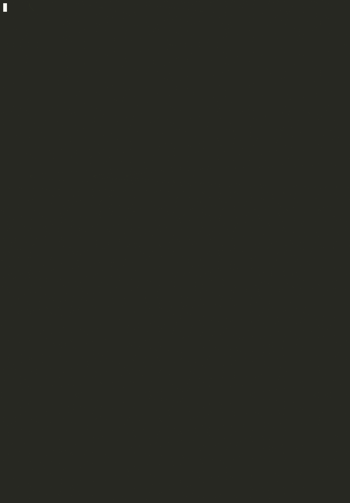

# Testsuite
A simple testsuite made to test your program. Feel free to use it in any of your projects.
## Demo

## Getting Started
You can simply execute the shell script given and insert your flags as follow:

    $ ./testsuite.sh -p template -v

**Or**

You can run the testsuite manually:

First install the requirements
  
    $ pip install -r requirements.txt

Then execute the testsuite:

    $ python3 path/to/the/testsuite/main.py -b path/to/your/program

## Writing tests

To write tests simply create a .yml file following the following pattern:

    - category: category_name
      tests:
        - name: test_name
          input: test_command
          returncode: expected_return_code (default:0)*
          todo: bool (default:false)* 
          has_stderr: bool (default:false)*

Each line with a ``*`` is optional and has a default value.
## Options

There are several options available for the testsuite

- ``-b`` : the path to the binary file of your program to test
- ``-p`` : the path to the tests directory
- ``-t`` : timeout of the execution for each test in seconds
- ``-c`` : specify one category to test
- ``-v`` : activate the verbose mode 

Made for Linux.

## License
[MIT License](LICENSE).
